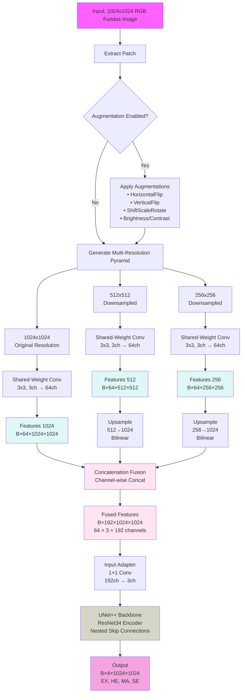

# Multi-Resolution UNet++ with Concatenation Fusion

## Architecture Diagram (Mermaid)

```mermaid
graph TD
    Start[Input: 1024x1024 RGB Fundus Image] --> Extract[Extract Patch]

    Extract --> Aug{Augmentation Enabled?}
    Aug -->|Yes| AugOps[Apply Augmentations<br/>• HorizontalFlip<br/>• VerticalFlip<br/>• ShiftScaleRotate<br/>• Brightness/Contrast]
    Aug -->|No| Pyramid
    AugOps --> Pyramid

    Pyramid[Generate Multi-Resolution Pyramid] --> P1024[1024x1024<br/>Original Resolution]
    Pyramid --> P512[512x512<br/>Downsampled]
    Pyramid --> P256[256x256<br/>Downsampled]

    P1024 --> Shared1[Shared-Weight Conv<br/>3x3, 3ch → 64ch]
    P512 --> Shared2[Shared-Weight Conv<br/>3x3, 3ch → 64ch]
    P256 --> Shared3[Shared-Weight Conv<br/>3x3, 3ch → 64ch]

    Shared1 --> F1024[Features 1024<br/>B×64×1024×1024]
    Shared2 --> F512[Features 512<br/>B×64×512×512]
    Shared3 --> F256[Features 256<br/>B×64×256×256]

    F1024 --> Concat
    F512 --> Up512[Upsample<br/>512→1024<br/>Bilinear]
    F256 --> Up256[Upsample<br/>256→1024<br/>Bilinear]

    Up512 --> Concat[Concatenation Fusion<br/>Channel-wise Concat]
    Up256 --> Concat

    Concat --> Fused[Fused Features<br/>B×192×1024×1024<br/>64 × 3 = 192 channels]

    Fused --> Adapter[Input Adapter<br/>1×1 Conv<br/>192ch → 3ch]

    Adapter --> UNetPP[UNet++ Backbone<br/>ResNet34 Encoder<br/>Nested Skip Connections]

    UNetPP --> Output[Output<br/>B×4×1024×1024<br/>EX, HE, MA, SE]

    style Start fill:#f5fe
    style Output fill:#e6c9
    style Concat fill:#f9c4
    style Fused fill:#f9c4
    style F1024 fill:#bee7
    style F512 fill:#bee7
    style F256 fill:#bee7
    style UNetPP fill:#ccbc
```